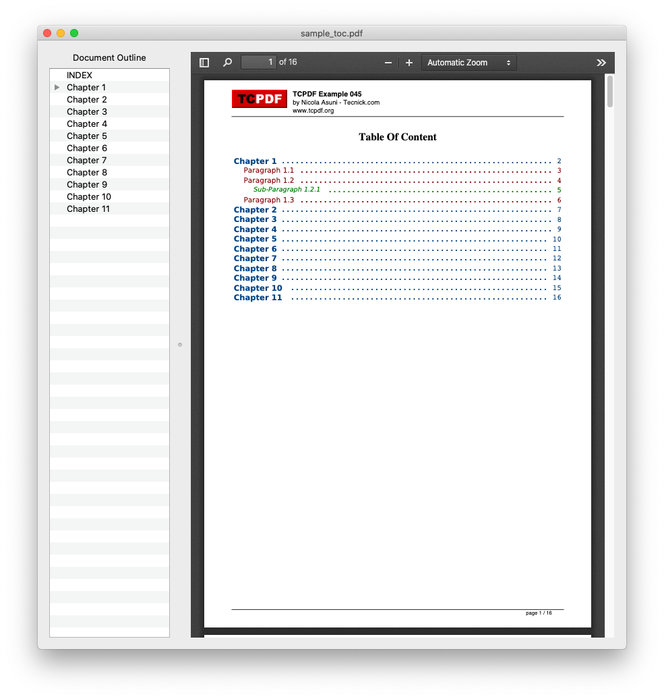

# Python PDF Bookmarker

For as long as I can remember, I've been frustrated that Mac's built in PDF viewer (Preview) doesn't support bookmarking PDF files. Sure, Adobe Acrobat Pro can do it, but who wants to pay hundreds of dollars for a personal license?

When I stumbled upon a Python package called [PyPDF2](https://pythonhosted.org/PyPDF2/), I was intrigued to see that it had the ability to create bookmarks. I soon realized that the solution to my PDF-bookmarking troubles was only a simple GUI away.

So, I built a simple Mac/Python application that allows a user to view and edit PDF files. The beauty of this app is that little of the code is original-- instead, it combines existing functionality to make something truly useful. The app fundamentally relies on:
* [PyPDF2](https://pythonhosted.org/PyPDF2/), for behind-the-scenes PDF manipulation
* PyQt5, for GUI functionality
* [PDF.js](https://mozilla.github.io/pdf.js/), a JavaScript platform to render PDFs in a browser (and in PyQt)

Here's a screenshot of the app in action-- simple but functional.

### Dependencies

The main dependencies for this project are PyQt5 and PyPDF2 (both available on PyPi), as well as the PDF.js constituent files. 

